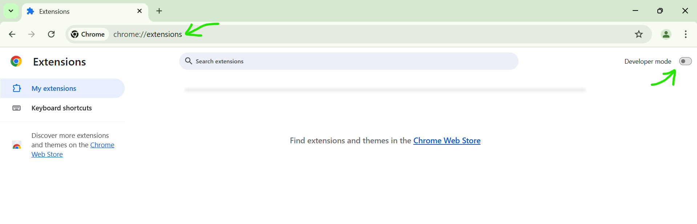
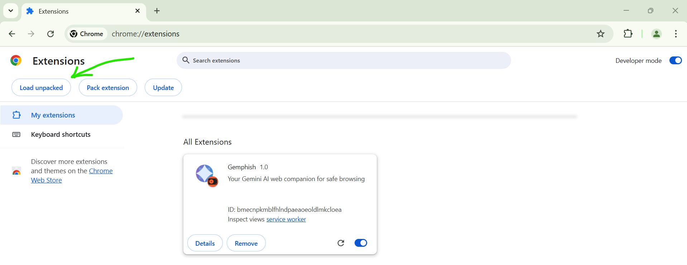
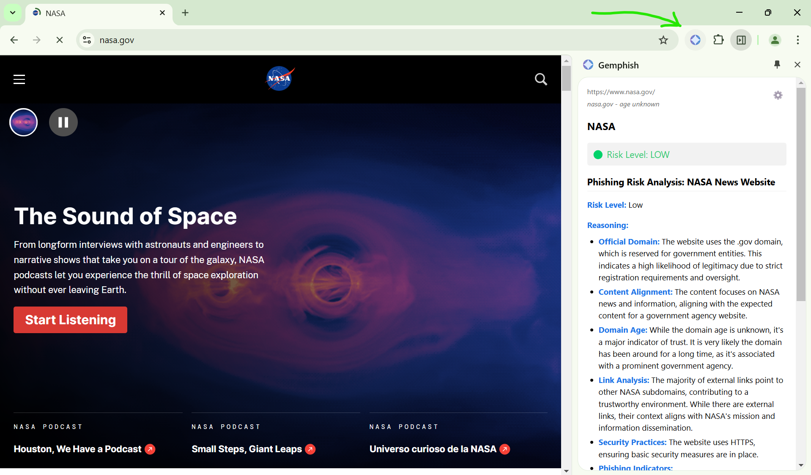
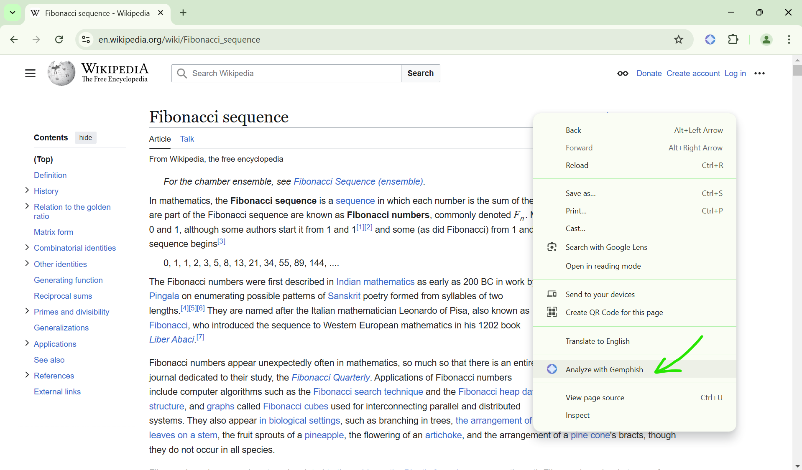
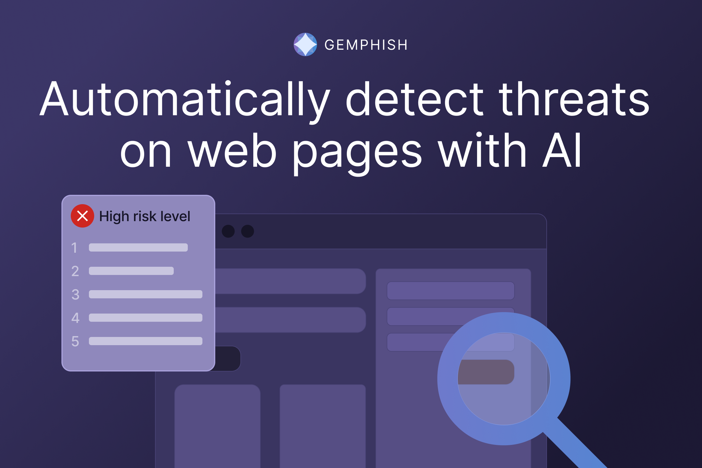

<div align="center">
  
</div>

# Gemphish - Your AI Web Safety Companion 🛡️

Gemphish is a Chrome extension that uses Google's Gemini AI to analyze web pages in real-time and protect you from potential online threats. Think of it as having a security expert by your side while browsing the internet, helping you make informed decisions about the websites you visit.

## 🎯 Problem & Solution

**Problem:**  
The internet can be a dangerous place, especially for non-technical users. Phishing attacks, scam websites, and malicious content are becoming increasingly sophisticated and harder to detect manually.

**Solution:**  
Gemphish provides real-time safety analysis of websites through an easy-to-use sidebar interface. It examines multiple factors to determine a website's trustworthiness:
- Domain age and reputation
- Content analysis for suspicious patterns
- External link analysis
- Security practices
- Presence of common phishing indicators
- Special trust indicators (e.g., .edu and .gov domains)

## ✨ Features

- **Real-time Analysis**: Automatically analyzes pages as you browse
- **Risk Level Assessment**: Clear Low/Medium/High risk ratings
- **Smart Domain Analysis**: Checks domain age and registration details
- **Content Scanning**: Identifies suspicious patterns and tactics
- **Link Analysis**: Examines external links and their proportions
- **User-Friendly Interface**: Clean sidebar design with clear risk indicators
- **Detailed Explanations**: Provides reasoning behind risk assessments

## 🚀 Getting Started

### Prerequisites
- Google Chrome browser
- Google Gemini API key ([Get it here](https://makersuite.google.com/app/apikey))

### Installation Steps

1. **Clone the Repository**
   ```bash
   git clone https://github.com/faridg/gemphish.git
   cd gemphish
   ```

2. **Load the Extension in Chrome**
   - Open Chrome and go to `chrome://extensions/`
   - Enable "Developer mode" in the top right corner 
   - Click "Load unpacked" and select the extension directory 

3. **Configure the Extension**
   - Click the extension settings icon (⚙️) in the sidebar
   - Enter your Gemini API key
   - Click Save

### Usage

1. Click the Gemphish icon in your Chrome toolbar or right click on any page and select "Analyze with Gemphish" <div style="display: flex; justify-content: space-between; margin: 20px 0;">
  
  
</div>
2. The sidebar will open, automatically analyzing the current webpage
3. View the risk assessment and detailed analysis
4. Use this information to make informed decisions about the website's safety

## 🛠️ Technical Details

The extension is built using:
- Chrome Extension Manifest V3
- Google Gemini API for AI analysis
- JavaScript (ES6+)
- Chrome Storage API for settings management
- RDAP protocol for domain age verification

Key files:
- `manifest.json`: Extension configuration
- `panel.js`: Main sidebar interface logic
- `api-utils.js`: Gemini API integration and analysis
- `domain-utils.js`: Domain age and verification utilities
- `options.js`: Settings management
- `background.js`: Context menu integration and sidebar behavior

## 🔒 Privacy & Security

- The extension only analyzes the content of pages you visit
- API key is stored in Chrome's storage
- No personal data is collected or stored
- All analysis is performed in real-time
- No external data storage (other than what Gemini API maintains)

## 🤝 Contributing

Contributions are welcome! Please feel free to submit a Pull Request. For major changes, please open an issue first to discuss what you would like to change.

<div style="display: flex; justify-content: space-between; margin-top: 40px;">
  
  
</div>

## ⚠️ Disclaimer

While Gemphish provides helpful analysis, it should not be your only tool for determining website safety. Always practice good internet safety habits and use multiple security measures.
